# typescript-snake-game

A TypeScript snake game with a clean architecture that is extremely well tested in Jest.

To install, install npm and Node.js, then `npm install`.
To play the snake game, `npm start`.
To run the Jest tests for snake game, `npm test`.

```mermaid
classDiagram
    abstractClass_Game <|-- SnakeGame: extends
    abstractClass_Game o-- interface_ICanvas

    SnakeGame*--SnakeGameLogic
    SnakeGame*--SnakeGameRenderer

    SnakeGameLogic *-- type_SnakePlayStatus
    SnakeGameLogic *-- Fruit
    SnakeGameLogic *-- Snake

    Fruit --> Snake

    SnakeGameRenderer *-- FruitRenderer
    SnakeGameRenderer *-- SnakeRenderer
    SnakeGameRenderer *-- SnakeOverlayRenderer
    SnakeGameRenderer *-- GridRenderer
    SnakeGameRenderer --> interface_ICanvas

    GridRenderer o-- type_GridRenderConfig
    GridRenderer o-- type_GridSize
    GridRenderer ..> type_GridPosition
    GridRenderer ..> Rect

    FruitRenderer --> Fruit
    FruitRenderer o-- type_FruitRenderConfig

    SnakeRenderer --> Snake
    SnakeRenderer o-- type_SnakeRenderConfig

    SnakeOverlayRenderer o-- type_SnakeOverlayConfig
    %% SnakeOverlayRenderer ..> type_SnakePlayStatus

    %% SnakeRenderer --> interface_ICanvas
    %% FruitRenderer --> interface_ICanvas
    GridRenderer --> interface_ICanvas

    interface_ICanvas ..> Color
    Snake ..> type_Direction
    interface_ICanvas ..> type_Direction
    interface_ICanvas ..> Vec2
    interface_ICanvas <|.. HTMLCanvas: implements

    type_GridRenderConfig ..> Color
    type_SnakeRenderConfig ..> Color
    type_FruitRenderConfig ..> Color
    type_SnakeOverlayConfig ..> Color

    class abstractClass_Game {
        protected canvas: ICanvas

        +constructor(ICanvas)
        +abstract onUpdate()
        +abstract onRender(ICanvas)
        +abstract onKeyDown(CanvasKeyEvent)

        +run(fps: number = 60)
    }

    class interface_ICanvas {
        +clear(color: Color)
        +drawRect(options: RectOptions)
        +drawLine(options: LineOptions)
        +drawEllipse(options: EllipseOptions)
        +drawText(options: TextOptions)

        +setKeyDownListener(fn: (key: CanvasKeyEvent) => void)
        +unsetKeyDownListener()
    }

    class HTMLCanvas {
      -context: CanvasRenderingContext2D
      -size: Vec2
      -canvasElement: HTMLCanvasElement

      +constructor(HTMLCanvasElement, size: Vec2)
    }

    class SnakeGame {
        -gameLogic: SnakeGameLogic
        -renderer: SnakeGameRenderer

        +constructor(ICanvas, GridSize, cellSize: Vec2)

        +onUpdate()
        +onRender(ICanvas)

        +onKeyDown(CanvasKeyEvent)
    }

    class SnakeGameLogic {
      +snake: Snake
      +fruit: Fruit
      -gridSize: GridSize
      -playStatus: SnakePlayStatus

      +constructor(GridSize)
      +tick()
      +onArrowKeyPressed(Direction)
      +onSpaceKeyPressed()
    }

    class type_SnakePlayStatus {
        'waiting' | 'playing' | 'lost'
    }

    class Snake {
        -positions: GridPosition[]

        +static createRandom(GridSize): Snake
        +extend(): Snake
        +tick(): Snake
        +changeDirection(Direction): Snake
        +hasCollision(GridSize): boolean
        +containsPosition(pos: GridPosition, skipHead?: boolean): boolean
    }

    class Fruit {
        -position: GridPosition

        +generateNewPosition(GridSize, snake: Snake)
    }

        class GridRenderer {
        -gridSize: GridSize
        -config: GridRenderConfig

        +constructor(GridSize, ICanvas, GridRenderConfig)

        +render(ICanvas)
        +fillCell(ICanvas, GridPosition, Color)
        +drawText/drawLine/drawEllipse(configs)

        +cellAtPosition(Vec2): GridPosition
        +cellContentRectAtPosition(GridPosition): Rect
    }

    class type_GridRenderConfig {
        +origin: Vec2
        +cellSize: Vec2
        +background: GridBackground
        +border: GridBorder
    }

    class type_FruitRenderConfig {
        +color: Color
    }

    class type_SnakeOverlayConfig {
        +pressSpaceTextColor: Color
        +lostHeaderTextColor: Color
        +snakeLengthTextColor: Color
    }

    class SnakeGameRenderer {
        -gridSize: GridSize
        -gridRenderer: GridRenderer
        -snakeRenderer: SnakeRenderer
        -fruitRenderer: FruitRenderer
        -overlayRenderer: SnakeOverlayRenderer

        +constructor(ICanvas, GridSize, cellSize: Vec2)
        +render(ICanvas, SnakeGameLogic)
    }
    class FruitRenderer {
        +config: FruitRenderConfig

        +render(ICanvas, GridRenderer, Fruit)
    }
    class SnakeRenderer {
        +config: SnakeRenderConfig

        +render(ICanvas, GridRenderer, Snake)
    }

    class SnakeOverlayRenderer {
        +config: SnakeOverlayConfig

        +render(ICanvas, SnakePlayStatus, snakeLength: number)
    }

    class Color {
      +r: number
      +g: number
      +b: number

      +static blue: Color
      +static grey(value: number): Color

      +asHexString(): string
      +add/sub/mul/div(other: Color): Color
      +lerp(other: Color, amount: number): Color
    }

    class Vec2 {
      +x: number
      +y: number
      +add/sub/mul/div(other: Vec2): Vec2
    }

    class Rect {
      +origin: Vec2
      +size: Vec2
    }

    class type_GridPosition {
      +row: number
      +col: number
    }

    class type_GridSize {
      +rowCount: number
      +columnCount: number
    }

    class type_SnakeRenderConfig {
      +color: Color
      +eyeColor: Color
    }

    class type_Direction {
        'left' | 'right' | 'up' | 'down'
    }
```

