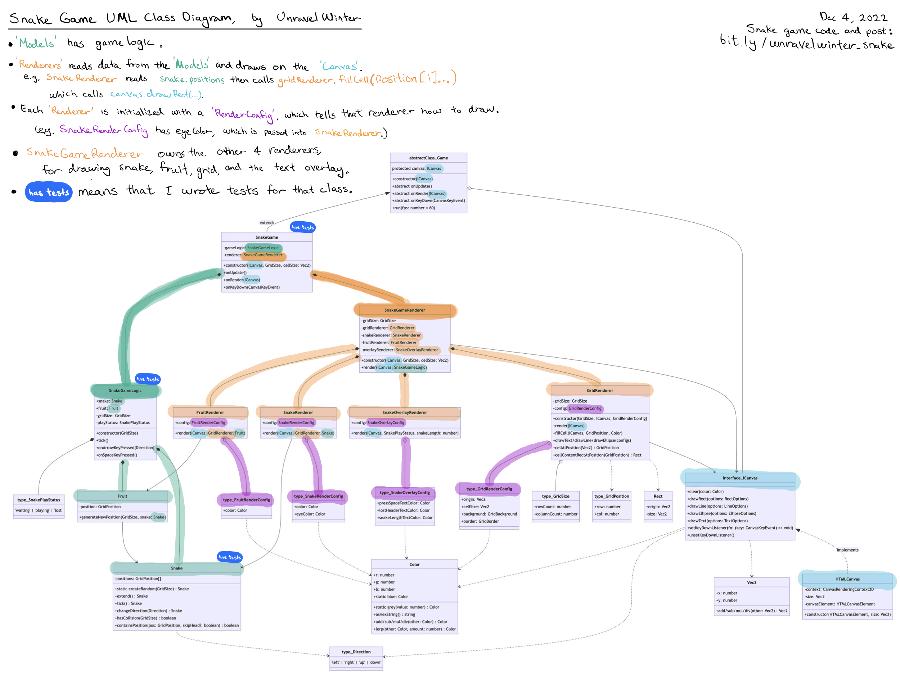
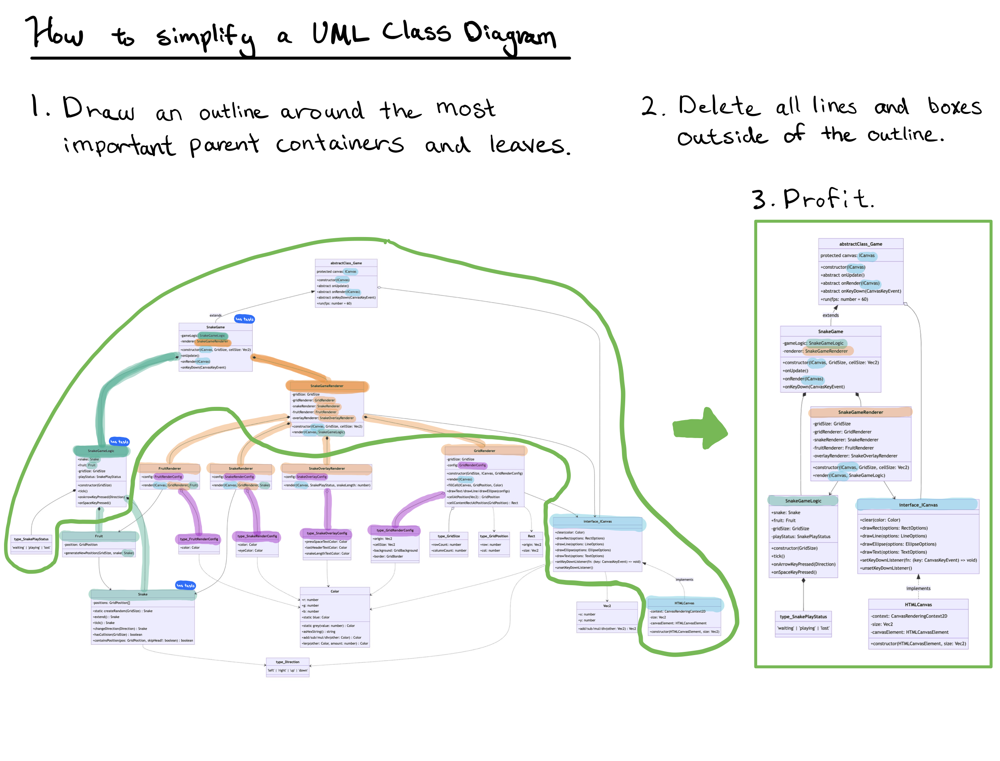
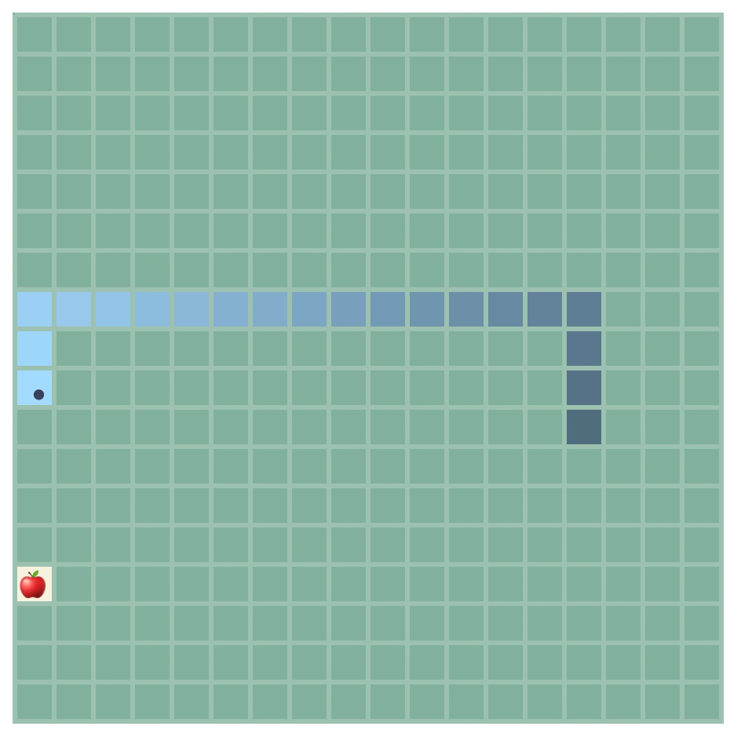
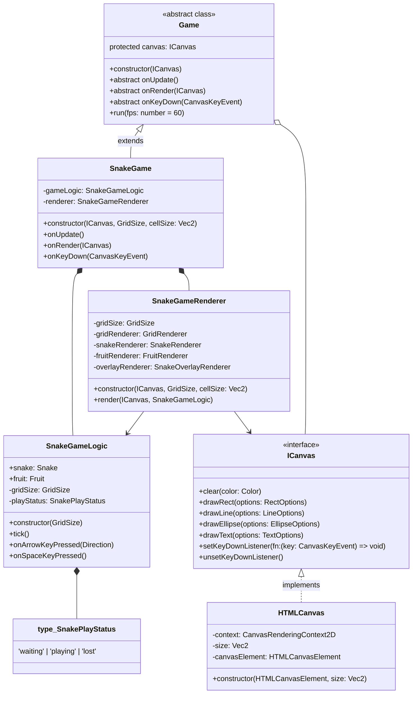

# typescript-snake-game

A TypeScript snake game with a clean architecture that is extremely well tested in Jest.

To install, install npm and Node.js, then `npm install`.
To play the snake game, `npm start`.
To run the Jest tests for snake game, `npm test`.

My Facebook Post: [bit.ly/unravelwinter_snake](https://www.facebook.com/groups/horizonwaffles/permalink/2382339205252918/)

## The diagrams were drawn in Mermaid

[Edit the complete diagram](https://mermaid.live/edit#pako:eNqtWFtv2zYU_iuEgCLOYiett7kt0XbonLQZlq5B3O1hy1DQEq0QkUmBouK4Sf77eNGFpMg4BeaXSOSncw6_c2XukpRlOIFJWqCqOiYo52h9SYH8oWUlOErFXO18_YjWGLy5n0zAgqJrrF4hwLcC06yK4pmEEyowX6EUf_1tjugNkmiD7-T8MJl0z2csJ-kj-xdSH-aYD4ToD4GEArEt8Ve9fl6g7UIgUVdR8AdeExHd1UutKg0Fk8k7d3lgWi-3NzYO1KtPBn6-wVwe6in4j5xku3DqMFH_2AK0JzWx_eqc0RXJd2EX5BsOYA4P3_WYc1YRQRiN4C5wKhwnOPZbHnQ3OzOs5dZmixBHWOPZ4SZzAisqzPOP91mzaxP37Fn4w46fQSC73-1yZYMd0hbBOuQ_Gh6DDW3znBXMDrf-IMeESz92Xg5__nTkXzidxvbf3B8egtMvn87MOwRkXRZ4janorA_Gsn-CsMODqEGMxWU5UWDDDFAX4lAxvTP76ldyJiRFOANpc0LPOep3kDIqhdSpYHzU7O9b260KwOifZYYEHkV2zbF2iPgdb4_Zho4MSL6d3Ei-9x2DeE1Hq1JaS-v1UsbXWzB73oh7cI8_9OmdfbACIz5KFWvQkGcblXG0USVjxEoVRFKdevtsXnzgGaG4B6q3CPCkKEhZWdhmIQL_Iltjj1VvPdCCVlg0xJ2RSvZSSfOKQjC6xlt5MpdK8PYduGEks1XVNCAhTGmfDz2XExkiQtrW6jKeJjSfm_XpcYesZB2HVtapj_U3JyazoKWgWepP6oTiADcGvfCw7V3nssNgkre9GoLQ_KAxvKllEERHiFiujEHbv8YgxUWx8I1UP0tEMI0C2ePsRtPmMRbMgNJRcVCpDWg3L7m4UhUJ2u1RUdacCAK3N8utsusxjSR_euoP67DVCupOfSBIet2TIA_5nnO2kWc757iqcDbqCrwNWpQy3S1QmINQT7SDYm-D5ChB8z1wD_bUkdrnglViL06rE1hlM49UhqZ2PPnnXzd3pXLphpRj6fQLRDO27snwvCHhZlYeBXYMX8P19ArRHHdkWbQNsVeokoWwIJUCWlYsGZPF0ot0gQit2lON5Gndc8p8vCblKUbZL50AX5THoZmNQxy6oh0Cc1WtJHd_4E1nTJ9ydlD7sdArduYVpzhEI92UPdl7IQgPs15eh4J9DJwiYcvwWl60d65IUcxlWXHLTe-DYF9TjeSo7VtHdl8yR_Lqiypb70VHrq5dvkMcsK77VKiGaX1nf7APm3k8lpyDocru3IyTnFC3jzSqF4MGIzeWKL3OOatpZsz-tXu3QYxnqsJrgH6OWzec05zBwhopdpQfd4qzhZSqgOlqprw1H4jUIFWOVIZh_ghIp8AZprm4CqNiDeL7MyK38ggG7o5mBrBvHDB0ddWwlX3ZgKGrsIYx98oDIzfc_6FJe1k49jppX128ghai8aCtHYFbZaB4-JptZsdGRki9e7cLqQ_cQ79bfbC2Wgb4l9KoHd7FdhfzfetuyryJ8fZesA-CJum4t6Ye3uK7lXywsvRX-pnJdO9lUWMv8dqtnOPt6AZpQGMYdK9q6gZUneLbhVAzs2rhlX7qtaAsO6rq5dG6Lo4ycjNi4gp3dxZfb4F56SDGAK1lrRND_QF6VMxb7NwOuNgOViLWNW2iL8WeJlX_LU2hmn7gXxdinaJtK7Zf2WZgqSzM7lpMnsp_V9bcZtAWWK9pYC9a8MNNI9Ay1Ky3xfMntZJupHNm2AKvhB5aJbNX5qku9Z9M3hX6KTYZJ2vM14hkCUy0gMtEunCNLxMoHzO8QnUhLpNL-iChqBZssaVpAmUNxeOk1reV5l--7WKJaALvktsEPh8n2wS-ePHy8PX01evZbPbjy9n01exhnHxjTOKfH742v1ez2Yufp9PpT-MEZ0TW5k_Nf5TVHy3xb_2BUvDwH-QGPGc)

```mermaid
classDiagram
    Game <|-- SnakeGame: extends
    Game o-- ICanvas

    SnakeGame*--SnakeGameLogic
    SnakeGame*--SnakeGameRenderer

    SnakeGameLogic *-- type_SnakePlayStatus
    SnakeGameLogic *-- Fruit
    SnakeGameLogic *-- Snake

    Fruit --> Snake

    SnakeGameRenderer *-- FruitRenderer
    SnakeGameRenderer *-- SnakeRenderer
    SnakeGameRenderer *-- SnakeOverlayRenderer
    SnakeGameRenderer *-- GridRenderer
    SnakeGameRenderer --> ICanvas

    GridRenderer o-- type_GridRenderConfig
    GridRenderer o-- type_GridSize
    GridRenderer ..> type_GridPosition
    GridRenderer ..> Rect

    FruitRenderer --> Fruit
    FruitRenderer o-- type_FruitRenderConfig

    SnakeRenderer --> Snake
    SnakeRenderer o-- type_SnakeRenderConfig

    SnakeOverlayRenderer o-- type_SnakeOverlayConfig
    %% SnakeOverlayRenderer ..> type_SnakePlayStatus

    %% SnakeRenderer --> ICanvas
    %% FruitRenderer --> ICanvas
    GridRenderer --> ICanvas

    ICanvas ..> Color
    Snake ..> type_Direction
    ICanvas ..> type_Direction
    ICanvas ..> Vec2
    ICanvas <|.. HTMLCanvas: implements

    type_GridRenderConfig ..> Color
    type_SnakeRenderConfig ..> Color
    type_FruitRenderConfig ..> Color
    type_SnakeOverlayConfig ..> Color

    class Game {
        <<abstract class>>
        protected canvas: ICanvas

        +constructor(ICanvas)
        +abstract onUpdate()
        +abstract onRender(ICanvas)
        +abstract onKeyDown(CanvasKeyEvent)

        +run(fps: number = 60)
    }

    class ICanvas {
        <<interface>>
        +clear(color: Color)
        +drawRect(options: RectOptions)
        +drawLine(options: LineOptions)
        +drawEllipse(options: EllipseOptions)
        +drawText(options: TextOptions)

        +setKeyDownListener(fn: (key: CanvasKeyEvent) => void)
        +unsetKeyDownListener()
    }

    class HTMLCanvas {
      -context: CanvasRenderingContext2D
      -size: Vec2
      -canvasElement: HTMLCanvasElement

      +constructor(HTMLCanvasElement, size: Vec2)
    }

    class SnakeGame {
        -gameLogic: SnakeGameLogic
        -renderer: SnakeGameRenderer

        +constructor(ICanvas, GridSize, cellSize: Vec2)

        +onUpdate()
        +onRender(ICanvas)

        +onKeyDown(CanvasKeyEvent)
    }

    class SnakeGameLogic {
      +snake: Snake
      +fruit: Fruit
      -gridSize: GridSize
      -playStatus: SnakePlayStatus

      +constructor(GridSize)
      +tick()
      +onArrowKeyPressed(Direction)
      +onSpaceKeyPressed()
    }

    class type_SnakePlayStatus {
        'waiting' | 'playing' | 'lost'
    }

    class Snake {
        -positions: GridPosition[]

        +static createRandom(GridSize): Snake
        +extend(): Snake
        +tick(): Snake
        +changeDirection(Direction): Snake
        +hasCollision(GridSize): boolean
        +containsPosition(pos: GridPosition, skipHead?: boolean): boolean
    }

    class Fruit {
        -position: GridPosition

        +generateNewPosition(GridSize, snake: Snake)
    }

    class GridRenderer {
        -gridSize: GridSize
        -config: GridRenderConfig

        +constructor(GridSize, ICanvas, GridRenderConfig)

        +render(ICanvas)
        +fillCell(ICanvas, GridPosition, Color)
        +drawText/drawLine/drawEllipse(configs)

        +cellAtPosition(Vec2): GridPosition
        +cellContentRectAtPosition(GridPosition): Rect
    }

    class type_GridRenderConfig {
        +origin: Vec2
        +cellSize: Vec2
        +background: GridBackground
        +border: GridBorder
    }

    class type_FruitRenderConfig {
        +color: Color
    }

    class type_SnakeOverlayConfig {
        +pressSpaceTextColor: Color
        +lostHeaderTextColor: Color
        +snakeLengthTextColor: Color
    }

    class SnakeGameRenderer {
        -gridSize: GridSize
        -gridRenderer: GridRenderer
        -snakeRenderer: SnakeRenderer
        -fruitRenderer: FruitRenderer
        -overlayRenderer: SnakeOverlayRenderer

        +constructor(ICanvas, GridSize, cellSize: Vec2)
        +render(ICanvas, SnakeGameLogic)
    }
    class FruitRenderer {
        +config: FruitRenderConfig

        +render(ICanvas, GridRenderer, Fruit)
    }
    class SnakeRenderer {
        +config: SnakeRenderConfig

        +render(ICanvas, GridRenderer, Snake)
    }

    class SnakeOverlayRenderer {
        +config: SnakeOverlayConfig

        +render(ICanvas, SnakePlayStatus, snakeLength: number)
    }

    class Color {
      +r: number
      +g: number
      +b: number

      +static blue: Color
      +static grey(value: number): Color

      +asHexString(): string
      +add/sub/mul/div(other: Color): Color
      +lerp(other: Color, amount: number): Color
    }

    class Vec2 {
      +x: number
      +y: number
      +add/sub/mul/div(other: Vec2): Vec2
    }

    class Rect {
      +origin: Vec2
      +size: Vec2
    }

    class type_GridPosition {
      +row: number
      +col: number
    }

    class type_GridSize {
      +rowCount: number
      +columnCount: number
    }

    class type_SnakeRenderConfig {
      +color: Color
      +eyeColor: Color
    }

    class type_Direction {
        'left' | 'right' | 'up' | 'down'
    }
```

[Edit the simplified diagram](https://mermaid.live/edit#pako:eNqtVl1v2jAU_SuWX0hHgoCOflhrpQnabhpVK-j2MCFVbmKY1WBHjgOllP--mw8SJyTsZX5J7r3H1z7H91reYld6DBPs-jQMR5wuFF3OBIJBX0KtqKuHceT5ji4Z-vLhOGgq6CuLTYLYm2bCCxvxEuBcaKbm1GXP34dUrCigU3ye55Pj5P9jueDukfgE1mOKqYMkyUQEUKQ3AXtO_I8-3Uw11VFYAe-zIMe5rqY4Bq3hEoMP3CBUp4O-Pd2PU5sgvgx8tmRC5_QTwetE26bxeARKauZq5iE3y1PRMB5tVwpIErlaKiuLnxjh_RJIip-BRzWzGqIp1X-k-ME2I7kWVgoC62YFrE5KG1KRsOYB7FZEyxeQ7gqddbN0uzL9Q-W2JjGfUWW50peKoGH8MTflKbqegDqWDDQHCQiKrYfUqALHXLACGFsNwBvf50FoYDNHA_wJWqDAxlYBNKAh05lwYx5Cz4DMc0GQ9co2wKwsJbq6RivJPXOpSNRkqJe0qLpCSwdKRMPe9mulJ83FYpj6-6McGfJ3aOxfzO0Xk5M5N2n9EmOBzFUwLZXiAc5GRfL6veddZ5aBs9j3JkF190SCUVmbEtR4VTT1io3uFPemsDUbucz3p9VNxsNIUdtGNd1Tija2zTEV0gspl6IdxoGMYe6cq4jDqdzGn_zIFhkjknPLQ0F-KWaZqrdkQbak1j5RzrqtuftaiAAkvyol18DtUbEwZJ414go6ErrBBE0DaHcDVK9B3SVuFkVrTbmGAm6hD9SKKe3_fRnq1nFZ8yu9VGSNimXBSV5hd4ZlgJLTmZTrsAaWnFcBuzVNAyZXTAGtSr6Hsve_lHZblSrXrtRfcT5JZWAbL5laUu7BoyERcIb1H-jvGSbw67E5jXw9wzOxAyiNtJxuhIsJ7IzZOEo6J3tmYDKnfgjegApMtvgNk_75Weei2-t_7vbOT89OBz0bbzDp7mz8LiVM6HYu0zE4v7zo9U8HFzZmHgfK99kzJv4kGX8nE-Jld38Bt7TcwQ)

